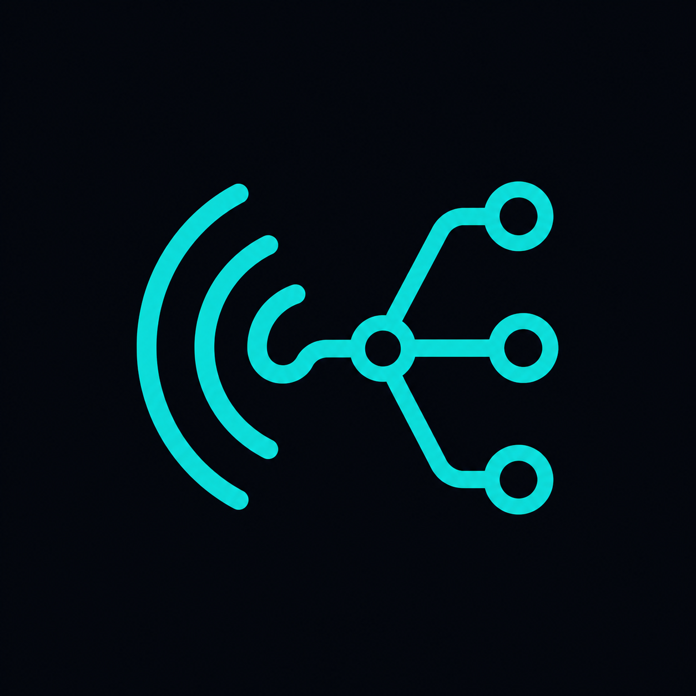

<p align="center">
  
</p>

# WebSpeak3

A browser-based web client for TeamSpeak 3 servers — same idea as the native
installable client, but running in a web browser. The TeamSpeak server side
stays exactly as-is (a regular TS server); only the client is being
reimagined.

**Status: private prototype, not for production use.**

## Features

- Connect to a real TeamSpeak (3/6) server, with optional server and
  default-channel passwords
- Remembers the last server/nickname you connected with
- Channel/client tree with correct ordering, click to switch channels
- Per-client status icons (channel commander, away, mic muted, deafened)
- Text chat: channel, server-wide, and private (1:1) — each in its own tab
- Voice with voice activation ("Sprachaktivierung", not push-to-talk),
  adjustable sensitivity, and per-client speaking indicators
- Audio output device picker (routes playback to a chosen device) — works in
  Chrome/Edge and Firefox 130+; playback is routed through a hidden `<audio>`
  element so device switching works even in browsers without
  `AudioContext.setSinkId`
- Light/dark theme

## Architecture

Browsers can't send raw UDP, which is what TeamSpeak's native protocol runs
over, so a pure client-side implementation isn't possible — a server-side
gateway is required that speaks the real TS protocol on one side and
WebSocket to the browser on the other.

```
Browser (web/)  <--WebSocket-->  Gateway (gateway/)  <--stdin/stdout JSON-->  Rust connector (connector/)  <--TS3/TS6 protocol-->  TeamSpeak Server
```

- **`web/`** — Vite + React frontend. TS3-lookalike UI: channel tree, chat
  tabs, voice controls.
- **`gateway/`** — Node.js/TypeScript WebSocket server. Spawns the Rust
  connector per browser connection and relays newline-delimited JSON events
  between it and the browser.
- **`connector/`** — Rust binary wrapping [`tsclientlib`](https://github.com/ReSpeak/tsclientlib)
  (vendored as a git submodule in `tsclientlib/`), the actual TS3/TS6
  protocol implementation. Handles connecting, channel/client state, chat,
  and Opus-encoded voice.

## Installation

See [INSTALL.md](INSTALL.md).

## Credits

The vast majority of this project's code was written by [Claude Code](https://claude.com/claude-code) (Anthropic's Claude), working iteratively with the repo owner one feature at a time.

---

### Legal / Disclaimer

**WebSpeak3** is an independent, open-source, self-hosted project and is
**not** affiliated with, associated with, authorized by, endorsed by, or in
any way officially connected with TeamSpeak Systems GmbH.

"TeamSpeak", "TS3", and related logos or names are registered trademarks of
TeamSpeak Systems GmbH. All product and company names are trademarks™ or
registered® trademarks of their respective holders. Use of them does not
imply any affiliation with or endorsement by them.
