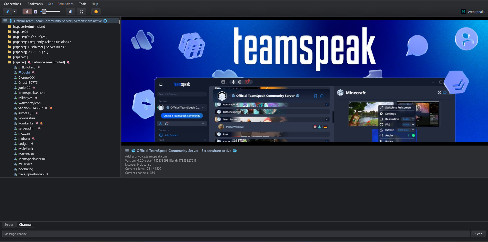
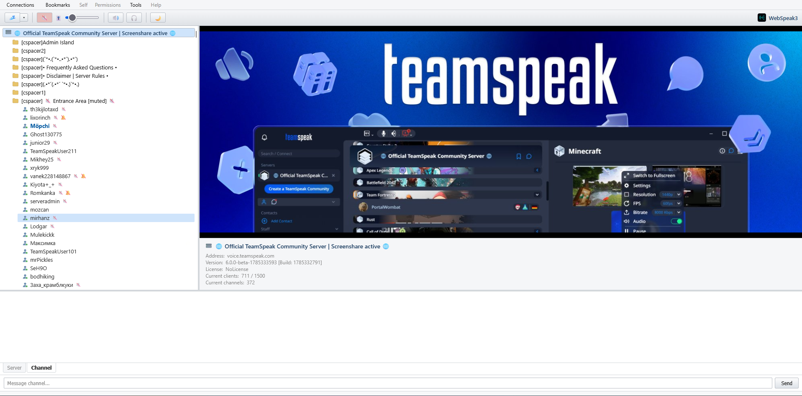

<p align="center">
  
</p>

<h1 align="center">WebSpeak3</h1>

<p align="center">
  <a href="#legal--disclaimer"></a>
  <a href="Dockerfile"></a>
  <a href="gateway/package.json"></a>
  <a href="connector/Cargo.toml"></a>
  
</p>

<p align="center">
  <b>A modern, self-hosted browser client for TeamSpeak 3 servers — no install, just open a tab.</b>
</p>

<p align="center">
  <a href="#-quick-start">🚀 Quick Start</a> ·
  <a href="INSTALL.md">📖 Installation</a> ·
  <a href="https://github.com/Moepchi/webspeak3/issues">🐛 Report Bug</a>
</p>

---

## 📸 Preview

<table>
  <tr>
    <th>Dark Mode</th>
    <th>Light Mode</th>
  </tr>
  <tr>
    <td></td>
    <td></td>
  </tr>
</table>

## ✨ Features

|  |  |
|---|---|
| 🔌 **Real TeamSpeak protocol** | Connects to actual TS3/TS6 servers over a WebSocket gateway — the server stays exactly as-is |
| 🎙️ **Low-latency voice** | Opus-encoded voice with voice activation ("Sprachaktivierung") and adjustable sensitivity |
| 🔊 **Custom audio output picker** | Route playback to any output device — works even in browsers without `AudioContext.setSinkId` |
| 💬 **Full text chat** | Channel, server-wide, and private (1:1) chat, each in its own tab |
| 🌳 **Live channel/client tree** | Correct ordering, status icons (channel commander, away, muted, deafened), click to switch channels |
| ⭐ **Favorites & reconnect** | Remembers your last server/nickname; switch servers without leaving your tab |
| 🌗 **Dark / light theme** | Clean, modern UI that adapts to your preference |
| 🔁 **Seamless reconnect** | Switch connections mid-session — old state tears down cleanly, no leaks or duplicates |

## 🧱 Tech Stack

<p>
  
  
  
  
  
  
</p>

<details>
<summary><b>🏗️ Architecture details</b></summary>

<br>

Browsers can't send raw UDP, which is what TeamSpeak's native protocol runs
over, so a pure client-side implementation isn't possible — a server-side
gateway is required that speaks the real TS protocol on one side and
WebSocket to the browser on the other.

```
Browser (web/)  <--WebSocket-->  Gateway (gateway/)  <--stdin/stdout JSON-->  Rust connector (connector/)  <--TS3/TS6 protocol-->  TeamSpeak Server
```

- **`web/`** — Vite + React frontend. TS3-lookalike UI: channel tree, chat
  tabs, voice controls.
- **`gateway/`** — Node.js/TypeScript WebSocket server. Spawns the Rust
  connector per browser connection and relays newline-delimited JSON events
  between it and the browser.
- **`connector/`** — Rust binary wrapping [`tsclientlib`](https://github.com/ReSpeak/tsclientlib)
  (vendored as a git submodule in `tsclientlib/`), the actual TS3/TS6
  protocol implementation. Handles connecting, channel/client state, chat,
  and Opus-encoded voice.

</details>

## 🚀 Quick Start

Spin up the whole stack with Docker Compose:

```bash
docker compose up -d
```

That's it — open `http://localhost:8080` (or your configured port/reverse
proxy) and connect to any TeamSpeak 3 server.

For manual/non-Docker setup, environment variables, and reverse-proxy notes,
see the full [Installation Guide](INSTALL.md).

## Credits

The vast majority of this project's code was written by [Claude Code](https://claude.com/claude-code) (Anthropic's Claude), working iteratively with the repo owner one feature at a time.

---

### Legal / Disclaimer

**WebSpeak3** is an independent, open-source, self-hosted project and is
**not** affiliated with, associated with, authorized by, endorsed by, or in
any way officially connected with TeamSpeak Systems GmbH.

"TeamSpeak", "TS3", and related logos or names are registered trademarks of
TeamSpeak Systems GmbH. All product and company names are trademarks™ or
registered® trademarks of their respective holders. Use of them does not
imply any affiliation with or endorsement by them.
